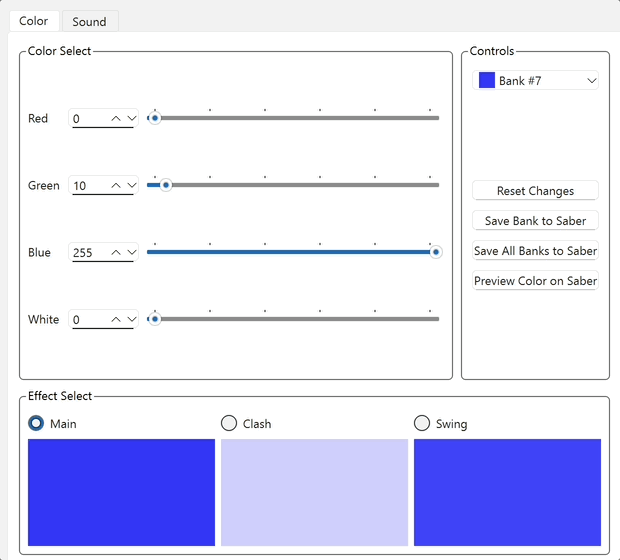

# Adjusting Colors

Although your Anima comes with seven pre-configured [color banks](banks.md), it is capable of displaying an enourmous range of colors. To understand how to customize colors effectively, let's first look at how the Anima creates colors.

## Anima LEDs

Your Anima projects colors using four LEDs located in the emitter at the base of your blade. Each LED emits a different color: **Red**, **Green**, **Blue**, or **White**. By adjusting the brightness of each LED, you can mix almost any shade!

For example, to make a purple color, you might increase the Red and Blue LEDs, while turning off the Green and White LEDs entirely. Or to make a lighter purple, you could add in a little bit of White.

By specifying a complete set of Red, Green, Blue, and White values, you can define any color your Anima is capable of projecting. Sometimes you will see this abbreviated to an *"RGBW"* vlaue. This means a set of values in order that define a particular color.

!!! question "RGBW vs. RGB"
    If you have worked with colors before, you may already be familiar with RGB (Red, Green, Blue) values. These are commonly used to specify colors in everything from art to web page design. RGBW adds in a separate White value, which is better for working with LEDs. RGBW allows for more accurate, brighter, and more diverse colors. If you'd like to lekarn more, see [this article](https://www.ledlightexpert.com/rgb-lights-vs-rgbw-lights).

## Setting Color Values

Tintallë lets you adjust the value of the Red, Green, Blue, and White LEDs. Each value ranges from **0 - 255**, with 0 representing no light of that color, and 255 representing that color at full brightness.

First, [select the effect](effects.md) you want to edit. To set a value, you can:

- Move the color slider
- Enter a value (0-255) in the text box
- Load a color set from a saved file

Tintallë will automatically adjust the preview for the selected effect with an approximation of the color for the values you have entered.

???- question "Why 'Approximation?'"
    Your Anima uses RGBW values to specify a color, but your computer screen uses RGB values. Converting RGBW to RGB is actually very tricky! In addition, each LED emits light at a specific wavelength, which may be slightly different from the wavelength your computer screen displays. To make things even more complicated, the material of your saber's blade will affect the color slightly too. The only way to be sure what a color will actually look like on your Anima is to [preview the color on your saber](#previewing-the-color-on-the-saber) directly!

    (In a future version of Tintallë, I hope to allow you to enter adjustment values for your LEDs to make your preview better match your individual Anima.)

!!! tip
    Setting the values does not automatically save them to your Anima! Nothing will be written to the Anima untill you choose to [save](saving.md) it.

## Previewing the Color on the Saber

The best way to see what a color will look like on your saber is to make your Anima show it! To do this, click the **Preview Color on Saber** button. This will send the currently selected color values to your Anima, which will then project that value for a few seconds.

For technical reasons, this preview will only last a few seconds (usually until the next charging indicator flash from your Anima). You can always click the **Preview** button again if you want.